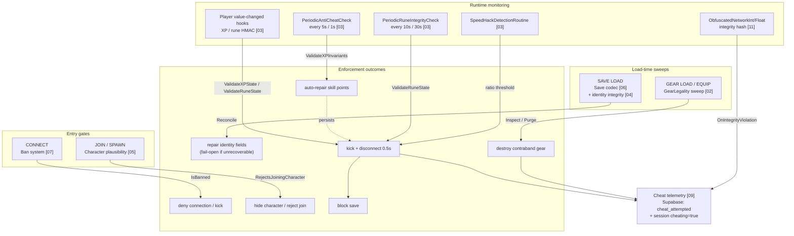
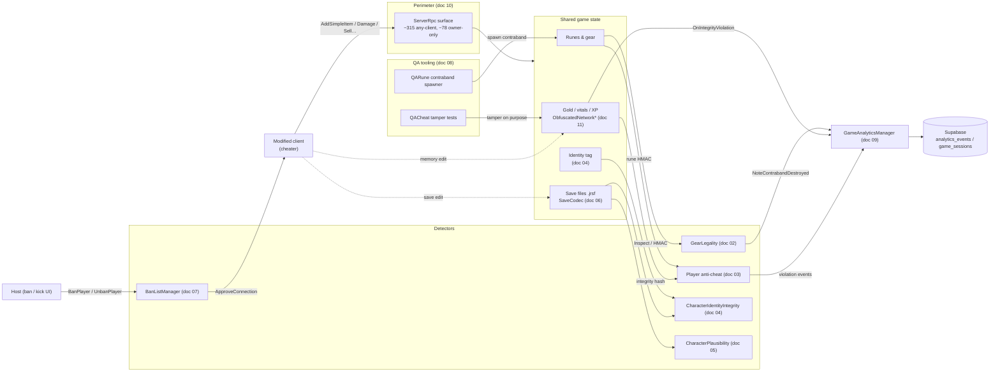
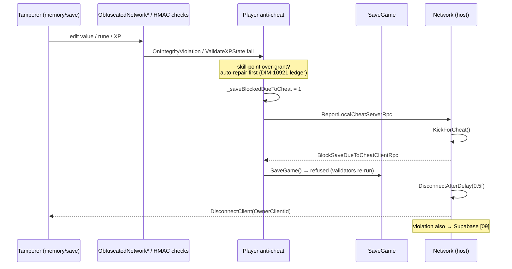

# 00 — Anti-cheat architecture graph (Mermaid)

> Visual companion to the docs. Renders in GitHub, VS Code (Markdown Preview Mermaid
> Support), and any Mermaid live editor. Interactive version: [`graph.html`](graph.html)
> (open in a browser).

## 1. Defense pipeline (timeline: connect → kick)

## 2. Who talks to whom (mechanism relationship map)

## 3. Kick escalation sequence (doc 03)

## 4. Node key

| Color (in `graph.html`) | Category |
|---|---|
| Blue | Perimeter (network authority) |
| Purple | Detectors / validators |
| Gray | Data & storage |
| Red | Enforcement outcomes |
| Orange | Telemetry |
| Green | QA tooling |
